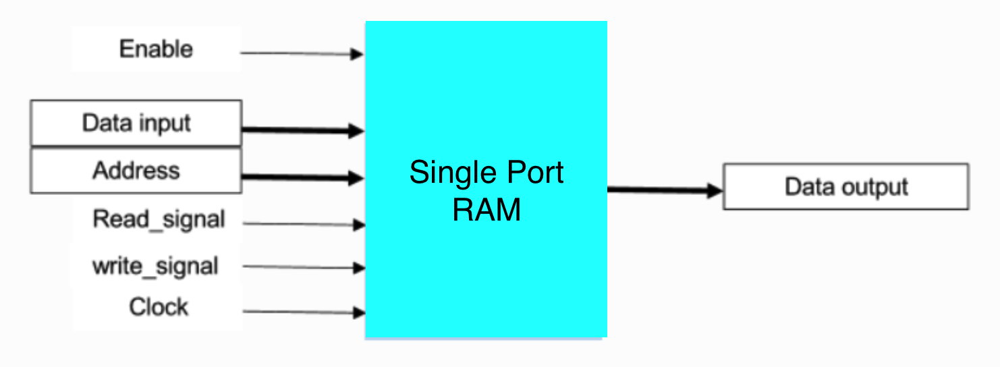

# Technical Specifications

| Project | Language | Hardware | School | Year | Team |
|-|-|-|-|-|-|
| Frogger Game | Verilog | - Go Board (**FPGA** technology) <br> - VGA Monitor and Cable | ALGOSUP | 2024-2025 | 7 |

#### *Last Update on October 13th, 2024*


<details>

<summary>

# Table of Contents  

</summary>

- [Technical Specifications](#technical-specifications)
      - [*Last Update on October 13th, 2024*](#last-update-on-october-13th-2024)
- [Table of Contents](#table-of-contents)
  - [Document Purpose](#document-purpose)
  - [Document Audience](#document-audience)
- [The Project](#the-project)
  - [Overview](#overview)
  - [Members](#members)
  - [Description](#description)
- [The Implementation](#the-implementation)
  - [GitHub](#github)
      - [1. GitHub files architecture](#1-github-files-architecture)
      - [3. GitHub rules](#3-github-rules)
  - [The Hardware](#the-hardware)
      - [1. The Go Board](#1-the-go-board)
      - [2. The VGA Screen](#2-the-vga-screen)
  - [The code](#the-code)
    - [I. Introduction about Verilog and FPGA](#i-introduction-about-verilog-and-fpga)
      - [1. Inside the FPGA](#1-inside-the-fpga)
      - [2. Parallelism of execution](#2-parallelism-of-execution)
      - [3. Modules and Instantiation](#3-modules-and-instantiation)
      - [4. Steps to upload the code](#4-steps-to-upload-the-code)
      - [5. To go further...](#5-to-go-further)
    - [II. Algorithm Description](#ii-algorithm-description)
      - [1. The State Machine](#1-the-state-machine)
      - [2. The Modules connections](#2-the-modules-connections)
      - [3. The Memory Management](#3-the-memory-management)
      - [4. VGA Display Process](#4-vga-display-process)
      - [5. Sprite Encoding and Display](#5-sprite-encoding-and-display)
      - [1. Base files](#1-base-files)
      - [2. Independent Modules](#2-independent-modules)
        - [VGA-related modules](#vga-related-modules)
        - [Switch-related modules](#switch-related-modules)
        - [Seven segments display related module](#seven-segments-display-related-module)
        - [Pseudo-Random generator module](#pseudo-random-generator-module)
      - [3. Game algorithm module](#3-game-algorithm-module)
        - [Global modules](#global-modules)
        - [Game logic module](#game-logic-module)
        - [Game design module](#game-design-module)
    - [IV. Coding conventions](#iv-coding-conventions)
      - [Indentation](#indentation)
      - [Comments](#comments)
      - [Naming](#naming)
- [Glossary](#glossary)

</details>

## Document Purpose

The content of this document aims to detail and explain all the technical aspects of the project. <br>
The question it answers is "**HOW to implement, technically, the decisions specified in the Functional Specification document ?**"<br>

The **Software Engineers** should find in it, all the implementation processes, conventions, choices and explanations required by the developers to deliver a structured, optimized, readable, and sustainable code.

## Document Audience
This document is primarily intended to

- **Software Engineers** - to understand the user and technical requirements, and be guided in decision-making and planning. Help them understand risks and challenges, customer requirements, and additional technical requirements based on the made choices.

But also to 

- **Program Manager** - to validate against the functional specification, and the client expectations
- **Quality Assurance** - to aid in preparing the test plan and to use it for validating issues.
- **Project manager** - to help identify risks and dependencies


# The Project
→ [link to the GitHub of the project](https://github.com/algosup/2024-2025-project-1-fpga-team-7)
## Overview

This student project, given by [ALGOSUP](https://github.com/algosup), is about coding the game *Frogger*, using a *Go Board* (based on **FPGA** technology), with the language *Verilog*. All the requirements as well as the game design and logic, are detailed in the [Functional Specification](https://github.com/algosup/2024-2025-project-1-fpga-team-7/blob/main/documents/Functional_specification/functional_specification.md) of the project.


## Members
| Role | Name | Author of |
|---|---|---|
| Project Manager   | [Laurent BOUQUIN](https://github.com/laurentbouquin) | Project Planning |
| Program Manager   | [Pavlo PRENDI](https://github.com/PavloPrendi) | [Functional Specifications](https://github.com/algosup/2024-2025-project-1-fpga-team-7/blob/main/documents/Functional_specifications/Functional_specifications.md) |
| Technical Leader  | [Benoît DE KEYN](https://github.com/benoitdekeyn) | [Technical Specifications](https://github.com/algosup/2024-2025-project-1-fpga-team-7/blob/main/documents/Technical_specifications/Technical_specifications.md) |
| Software Engineer | [Maxime THIZEAU](https://github.com/MaximeTAlgosup) | [Source Code](https://github.com/algosup/2024-2025-project-1-fpga-team-7/tree/main/src) |
| Software Engineer | [Tino GABET](https://github.com/Furimizu) | [Source Code](https://github.com/algosup/2024-2025-project-1-fpga-team-7/tree/main/src) |
| Quality Assurance | [Paul NOWAK](https://github.com/PaulNowak36) | [Test Plan](https://github.com/algosup/2024-2025-project-1-fpga-team-7/blob/main/documents/Quality_assurance/Test_plan.md) |
| Technical Writer  | [Thomas PLANCHARD](https://github.com/thomas-planchard) | User Manual |


## Description

The game is a simple game where the player controls a frog that must cross a road.
The frog can move in 4 directions (up, down, left, right).
The frog must avoid cars that move from left to right.


| Requirements |
| ----- | 
| Utilisation of Go-Board. |
| Frog can move at least in one direction. |
| Utilisation of the VGA on the Go-Board. |
| No use of other hardware. |
| Immobile cars (Have at least one on the screen). |
| The game will be played on a 20x15 grid(each grid will be 32x32 pixels). |
| The game can be restarted by pressing all 4 buttons(Hold the buttons for at least 2 seconds). |
| There will be at least 1 level |
| The frog should move 1 tile at a time |
| When the frog collides with the car the game will restart. |
| There will be at least 5 rows of roads |
| The buttons will be functional at every click. |

| Objectives |
| -- |
| The frog will be a sprite with full colors. |
| The cars will be moving on the roads from left to right(there will be at least 16 max on screen). |
| The speed of the cars will increase with the difficulty. |

| Bonus | 
| -- | 
| New roads will be added with increasing difficulty. |
| The frog and cars will have slight animation. |
| There will be an end screen when you beat the game. |
| Adding a variety of cars with different colors and models. |


# The Implementation


## GitHub

#### 1. GitHub files architecture

```  
origin  
│
├── documents
│    │
│    ├── Management
│    │    ├── data
│    │    ├── Weekly_report.md
│    │    └── Project_planning.md
│    │
│    ├── Functional_specifications
│    │    ├── data
│    │    └── Functional_specifications.md
│    │
│    ├── Quality_assurance
│    │    ├── data
│    │    └── Test_plan.md
│    │
│    ├── User_manual
│    │    └── User_manual.pdf
│    │
│    └── Technical_specifications
│         ├── data
│         └── Technical_specifications.md
│
├── src
│    │
│    ├── apio.ini
│    ├── Go_Board_Constraints.pcf
│    ├── Frogger_Games.v
│    └── ... (modules)
│
└── README.md
```

#### 3. GitHub rules

- The main branch is protected from direct push and merge.  
  
- To update the main branch, the pull request needs 2 external validations from anyone else.  
  
- A 'dev' branch is here to push all the source code modifications.
  
- A 'documents' branch is here to push all the document's modifications. 
  
- Each member has to commit and push changes at least daily, with an explicit title and a complete description of the changes.  
  
- The name of a branch follows ```kebab-case```

## The Hardware

Here is only the description of the provided hardware for this project.

#### 1. The Go Board

For this project, we have been given a 'Go Board'.
Here is the official website of this board: https://nandland.com/the-go-board/  
This Go Board had been designed to meet the needs of the game while remaining simple to use. As we can see, there's already, on the board itself a bunch of useful components for video games.


The main component of this board is an FPGA chip :   
    
The [Lattice iCE40 - HX1K](https://www.latticesemi.com/ice40)  

This FPGA is composed of the following elements :


Thus, the FPGA contains 1280 Logic Cells (either LUT or Register) and 16 384 bits of 'BLock RAM' memory. These two numbers are important to keep in mind when designing the game.

For more information about the FPGA and the Go Board, [check here](#5-to-go-further).


#### 2. The VGA Screen

We had been given a common FullHD VGA screen and its cable to display the game.

## The code

### I. Introduction about Verilog and FPGA

#### 1. Inside the FPGA
[Youtube Video to understand how the FPGA works](https://www.youtube.com/embed/iHg0mmIg0UU?si=PVsuK7WJKbZwVpu2)


#### 2. Parallelism of execution

It's important to keep in mind that the FPGA is a parallel execution device. This means that all the code is executed at the same time. This is why we have to be careful with memory usage and the number of logic cells used.

Concretely, this means that all the always loops spread in the code are executed simultaneously.

While in a processor, the code is executed sequentially, line by line and the results of the previous lines are used in the next ones,  
In FPGA, input information goes across a complex circuit of logic gates, and the output is the instant result of the whole circuit.


#### 3. Modules and Instantiation

In Verilog, we can define modules, which are like functions in other languages.

Concretely, a module is an electronic scheme using FPGA components. Each time a module is used in the program, The computer will burn into the FPGA the electronic scheme corresponding to the module. Then, you simply have to connect the inputs and outputs of the module to the rest of the program to use it as a function.

The usage of a new instance of a module on the FPGA is called instantiation.

An example of a complex process with FPGA using modules wired together :


#### 4. Steps to upload the code

When the code is ready, the next step is to upload it to the FPGA.

Here is the official tutorial to do that :  
[Nand Land - Tutorial to upload a verilog program in your Go Board](https://nandland.com/set-up-apio-fpga-build-and-program/)

Each Verilog code Has to be in a folder containing at least :
- top_module.v  
  This file contains the top module of the code, which is the one that calls all the other modules. You can name it as you like, but don't forget to change the name in the apio.ini file.  

- apio.ini   
  This file is needed by the synthesizer to know which is the top module to execute.  

When you upload your code, the APIO synthesizer will compile the code, and then upload it to the FPGA.

The synthetization process is the one that will transform the Verilog code into a binary file that the FPGA can understand.

It analyzes the code, and then, depending on the FPGA's architecture, it will create a circuit of logic gates that will be able to execute the code.

Warning: On Windows, the APIO synthesizer doesn't optimize really the code, to make it work with the minimum number of logic cells on the FPGA. Thus, maybe only a Mac or Linux computer will be able to synthesize a code without any overflow of logic cells.

#### 5. To go further...

- [Go Board Tutorials](https://nandland.com/go-board-tutorials/)
- [Go Board PCB schematic](data/Go_Board_PCB_scheme.pdf)
- [FPGA Datasheet](data/FPGA-DS-02029-4-2-iCE40-LP-HX-Family-Data-Sheet.pdf)
- [Technology Library for FPGA](data/FPGA-TN-02026-3-3-iCE40-Technology-Library.pdf)
- [FPGA Tutorials](https://youtube.com/playlist?list=PLEBQazB0HUyT1WmMONxRZn9NmQ_9CIKhb&si=ZDZhqj2Bj44o1vI3)

### II. Algorithm Description

Future organigram to describe the evolution of the state machine, and interaction between the different modules and memory units.

#### 1. The State Machine

The game is based on a state machine. This state machine is the main module of the code, and it's the one that will call all the other modules.

In this module, are declared all the variables that will keep track of the game's state.
Here will be defined the main loop, the gameover and game restart loops and so on.

#### 2. The Modules connections

In this part, we will describe how the different modules are connected together.

*Future*: Organigram to describe the connections between the different modules.

#### 3. The Memory Management

In this part, we will describe how the memory is managed in the code.

The memory is used to store the sprites that will be displayed on the screen. The memory is a block of bits that can be read and written by the code.

On the code upload, the memory is filled with the sprites from a binay txt file. A python program is used to convert the sprites from a Bitmap file to a binary txt file adapted to memory storage.

Thus the memory will be as many blocks of bits as there are sprites to display. Each block will contain the information of a sprite.  
It will be single-port memory, which means that only one block can be read or written at a time, as we won't need to write in it during the game.

To know more about how to implement memory, please refer to:
- [How to use the memory block of an iCE40 - Website](https://www.digikey.com/en/maker/projects/introduction-to-fpga-part-8-memory-and-block-ram/df7bcadef0de430ab89d0d9c21e3a14c)
- [Memory Usage for FPGA - PDF](data/FPGA-TN-02002-1-7-Memory-Usage-Guide-for-iCE40-Devices.pdf)

You will find in these documents all the information needed to implement a memory block in Verilog, and that is how the memory will look like :



In a block RAM, the width is the number of bits of each block, and the depth is the number of blocks.   
In our case, the width will be 9 bits (3 bits for each Red, Green and Blue component), and the depth will be 1024 blocks (the number of pixels in a sprite).

```verilog
module RAM_1Port #(parameter WIDTH = 9, parameter DEPTH = 1024) (
  input                     i_Clk,
  // Shared address for writes and reads
  input [$clog2(DEPTH)-1:0] i_Address,
  // Write Interface
  input                     i_Write_signal,
  input [WIDTH-1:0]         i_Written_Data,
  // Read Interface
  input                     i_Rd_Enable,
  output reg                o_Read_signal,
  output reg [WIDTH-1:0]    o_Read_Data
  );
  
  reg [WIDTH-1:0] r_Mem [DEPTH-1:0];

  always @(posedge i_Clk)
  begin
    // Handle writes to memory
    if (i_Write_signal)
    begin
      r_Mem[i_Address] <= i_Written_Data;
    end

    // Handle reads from memory
    o_Read_Data <= r_Mem[i_Address];
    o_Read_signal   <= i_Rd_Enable; // Generate DV pulse
  end

endmodule
```

#### 4. VGA Display Process

The VGA display is handled by 3 modules and we won't need to fully explain them as it is related to the VGA working process. This VGA chip works with a 60Hz refresh rate, and the VGA screen is composed of 640x480 pixels.

The VGA display is controlled by 3 signals :
- HSync : Horizontal synchronization signal
- VSync : Vertical synchronization signal
- RGB : The color signal on 9 bits (3 bits for each Red, Green and Blue components)

Then, the VGA chip will automatically, 60 times per second, scan each pixel of the screen, and for each pixel, write on it the color of the RGB signal read at this moment. That's why 2 variables are used to keep track of the next pixel to be written on the screen. These variables are HCount and VCount.

Then, Hsync and Vsync signals are here to handle different screen sizes. A pixel will be written only if Hsync and Vsync are both LOW. However, it's not mandatory to deep dive into this concept as the module is already provided.

Example to write a green pixel on the middle of the screen :
```verilog
always @ (posedge clk) begin
  if (HCount == 320 && VCount == 240) begin
    o_VGA_Red_1 <= 0;
    o_VGA_Red_2 <= 0;
    o_VGA_Red_3 <= 0;
    o_VGA_Green_1 <= 1;
    o_VGA_Green_2 <= 1;
    o_VGA_Green_3 <= 1;
    o_VGA_Blue_1 <= 0;
    o_VGA_Blue_2 <= 0;
    o_VGA_Blue_3 <= 0;
  end
end
```

However, each color will be assigned in a 9 bits-wide register and will be written as :
```verilog
// Here we connect the module to the VGA chip
module Frogger_Game (
  ...
  output o_VGA_HSync, o_VGA_VSync,
  output o_VGA_Red_1, o_VGA_Red_2, o_VGA_Red_3,
  output o_VGA_Green_1, o_VGA_Green_2, o_VGA_Green_3,
  output o_VGA_Blue_1, o_VGA_Blue_2, o_VGA_Blue_3
  ...
);

...

// Here we generate the synchronization signals and the counters for columns and rows
module VGA(
  ...
  .o_VGA_HSync(o_VGA_HSync),
  .o_VGA_VSync(o_VGA_VSync),
  .o_HCount(HCount),
  .o_VCount(VCount),
  ...
);

...

reg [8:0] pixel_color;

// Here we write the color of the pixel to be displayed in the color register

always @ (posedge clk) begin
  if (HCount == 320 && VCount == 240) begin
    pixel_color <= 9'b000_111_000;
  end
end

...

// Here we connect the color register value to the VGA output

assign o_VGA_Red_1 = pixel_color[8];
assign o_VGA_Red_2 = pixel_color[7];
assign o_VGA_Red_3 = pixel_color[6];
assign o_VGA_Green_1 = pixel_color[5];
assign o_VGA_Green_2 = pixel_color[4];
assign o_VGA_Green_3 = pixel_color[3];
assign o_VGA_Blue_1 = pixel_color[2];
assign o_VGA_Blue_2 = pixel_color[1];
assign o_VGA_Blue_3 = pixel_color[0];

```

#### 5. Sprite Encoding and Display

Each sprite will be stored in the memory using an adaptative encoding to optimize space.

Each sprite is a 32x32 pixels array. So 1024 pixels per sprite.

If we did use 9 bits per pixel and even 10 if we would take transparency into account, we would need 1024x10 = 10240 bits per sprite. However, we only have 64Kbits of memory, so we could barely store 6 sprites.

Now let's imagine we need 7 different colors in a sprite, we will give an index for each color, and with transparency, we will need 8 different values for each pixel. To store 8 values we need only 3 bits (8 = 2^3), and 1024 pixels x 3 bits = 3072. So we need only 3072 bits to store this sprite.    
Then, when we need to access the memory to display the color, we simply read the color index table of this sprite and make each 3-bit index match with the corresponding 9-bit color and display it.

A sprite has several attributes :
- Its position on the screen
- Its color index table
- Its identifier
- The number of colors used in the sprite (or the index size)

As already said, all the sprites will be loaded in memory before the game execution thanks to a binary file generated from a Bitmap file using a very simple Python program.

#### 1. Base files

- **apio.ini**  
  Needed by the synthesizer to know which is the top module to execute.  

- **Go_Board_Constraints.pcf**  
  Contains the attribution of each GPIO to a name. These names are used at the beginning of the top module.  

- **Frogger_Game.v**   
  The main file containing the top module. It serves to declare, include and link the different pieces of the code.  

#### 2. Independent Modules

These modules are some universal modules, which can be used in many different types of FPGA projects. They are not containing any code related to the game algorithm.

##### VGA-related modules
- **VGA_Sync_Pulses.v**   
  Generates the horizontal and vertical synchronization signals for the VGA output.  

- **VGA_Sync_Porch.v**  
  Change a bit the pulses of the previous module to take the VGA porches into account.  

- **Sync_To_Count.v**  
  Generates 2 counters, one for the columns, and another for the rows, synchronized with both pulses, to keep track of which pixel is going to be written on the VGA output.

##### Switch-related modules
- **Debounce_Filter.v**  
  The module which takes the switch signal and outputs a 'debounced' signal of the switch. It allows the output signal to fit the input signal after validating its stability over time.

##### Seven segments display related module
- **Seven_Segments_Display.v**  
  Takes a binary input and handles the display of the corresponding character on the 7 segments display.

##### Pseudo-Random generator module
- **LFSR.v**  
  This module can generate pseudo-random numbers.

#### 3. Game algorithm module

These modules contain all the code directly related to the game logic and handling the game design.

##### Global modules
- **Constants.v**  
  In this file, each constant value is stored as a label, usable through all the files.  

- **Memory.v**  
  This file is here to define the memory modules needed to store each sprite

##### Game logic module
- **State_Machine.v**  
  In this file are defined the variables which keep track of the current state of the game.
  This file handles all module's instantiation.  

- **Clock_Divider.v**  
  This file generates the different clocks used to delay the update frequency of movement or display.
  It takes as input the wanted speed for each sprite-related always loop.  

- **Levels.v**  
  This module handles all the modifications such as speed, car position, related to the level increase.  

- **Character_Control.v**  
  In this module, the switches control the frog position.   

- **Obstacles_Movement.v**    
  In this module, the cars are moved at a certain speed and direction.  

- **Collisions.v**   
  Here the collisions between the frog and the cars are checked according to their position.

##### Game design module
- **Sprite_Definition.v**  
  This module handles all sprites' design, encoding and storage in memory.  

- **Sprite_Display.v**  
  This module handles the display of the sprites on the VGA screen from the memory.  

- **Background_Display.v**  
  This module handles the display of the background on the VGA screen.

### IV. Coding conventions

When coding in Verilog, it's important to keep the code clean and readable. Here are some conventions to follow :

#### Indentation
  - **Tabulation** - Use **4 spaces** for statement indentation.  
  
  - **Alignment** - When declaring multiple in/output, reg, wire, parameter, assign, ...  
    Align the beginning of the names and values as well as the common signs (=, ;, ...).  
  
  - **begin/end** - In a statement, the 'begin' keyword should be indented, **underneath** the statement declaration. As well, the 'end' keyword should be aligned with the 'begin' keyword, alone on the last line of the statement.  
  
#### Comments
  - Use comments to **explain** the code  
  
  - The comments should be placed **before** the code they explain.  
  
  - Use comments to explain the **purpose** of the code, not the code itself.  
  
  - Use comments when declaring a reg, wire, parameter, ... to explain its purpose and its value.  
  
  - For each module, describe how to use the module, its purpose, the inputs and outputs, and the global behavior of the module.  
  
#### Naming
  - **Module** - The names of the modules are given [here](#iii-code-files-architecture). The name of the file is also the name of the module (aside '.v').  
  
  - **Instances** - The name of the instance of a module should be the same as the module name, with a suffix ```_Inst_X``` where X is the numbering.  
  
  - **localparameters** - The name of a local parameter is in ```SCREAMING_CAMEL_CASE```.  
  
  - **parameters** - The name of a parameter is in ```SCREAMING_CAMEL_CASE``` and is stored in the 'Constants.v' file.
  
  - **input/output** - The name of an input or output begins with either ```i_``` or ```o_``` and is in ```apple_Snake_CASE``` *  
 
  - **Registers** - The name of a register begins with ```r_``` and is in ```apple_Snake_CASE``` *.  
  
  - **Wires** - The name of a wire begins with ```w_``` and is in ```apple_Snake_CASE``` *.  
  
  *(Apple snake case: basically, the only rule is to have an underscore between words. Apple stands for "Any uPPer/Lower casE").   
   
  


# Glossary

This glossary is here to help to understand the technical vocabulary of this document. 

| Term | Definition |
| ---- | ---------- |
| FPGA | A field-programmable gate array (FPGA) is a type of programmable microcontroller, where you can program only the components you need to create your integrated circuit. FPGAs are often used in custom-made products and in research and development. Other applications for FPGAs include aerospace or industrial sectors, due to their flexibility, high signal processing speed, and parallel processing abilities. |
| Verilog | Verilog is one of the languages used to program FPGAs. |
| VGA | Video Graphics Array (VGA) is a standard for video display controller first introduced with the IBM PS/2 line of computers in 1987. |
| Lattice iCE40 - HX1K | The Lattice iCE40 is a family of FPGAs developed by Lattice Semiconductor. The HX1K is the smallest model of this family. |
| Go Board | The Go Board is a development board based on the Lattice iCE40 FPGA. |
| Sprite | A sprite is a two-dimensional image or animation that is integrated into a larger scene. |
| APIO | APIO is a tool that allows you to synthesize and upload Verilog code to an FPGA. |
| Binary file | A binary file is a computer file that is not a text file. It may contain data in a binary format that is only understood by the computer. |
| Bitmap file | A bitmap file is an image file format used to store digital images. |
| Debounce | Debouncing is the process of removing noise from a signal. In this context, it is used to remove noise from the switch signal. |

