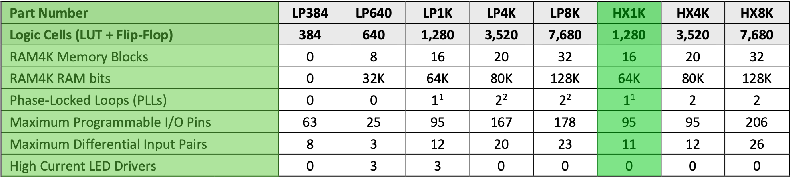
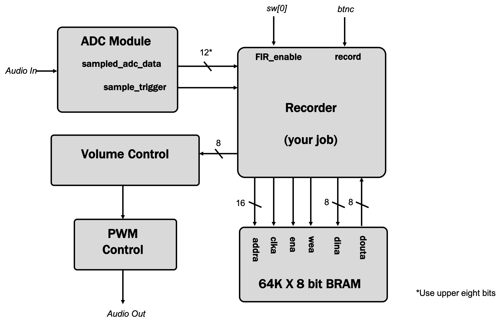

# Technical Specification

| Project | Language | Hardware | School | Year | Team |
|-|-|-|-|-|-|
| Frogger Game | Verilog | - Go Board (**FPGA** technology) <br> - VGA Monitor and Cable | ALGOSUP | 2024-2025 | 7 |

#### *Last Update on October 10th, 2024*


<details>

<summary>

# Table of Content  

</summary>

- [Technical Specification](#technical-specification)
      - [*Last Update on October 10th, 2024*](#last-update-on-october-4th-2024)
- [Table of Content](#table-of-content)
  - [Document Purpose](#document-purpose)
  - [Document Audience](#document-audience)
- [The Project](#the-project)
  - [Overview](#overview)
  - [Members](#members)
  - [Description](#description)
- [The Implementation](#the-implementation)
  - [GitHub](#github)
      - [1. GitHub files architecture](#1-github-files-architecture)
      - [3. GitHub rules](#3-github-rules)
  - [The Hardware](#the-hardware)
      - [1. The Go Board](#1-the-go-board)
      - [2. The VGA Screen](#2-the-vga-screen)
  - [The code](#the-code)
    - [I. Introduction about Verilog and FPGA](#i-introduction-about-verilog-and-fpga)
      - [1. Inside](#1-inside)
      - [2. Parallelism of execution](#2-parallelism-of-execution)
      - [3. Modules and Instanciation](#3-modules-and-instanciation)
      - [4. Steps to upload the code](#4-steps-to-upload-the-code)
      - [5. To go Further...](#5-to-go-further)
    - [II. Algorithm Desccription](#ii-algorithm-desccription)
    - [III. Code files architecture](#iii-code-files-architecture)
      - [1. Base files](#1-base-files)
      - [2. Independant Modules](#2-independant-modules)
        - [VGA related modules](#vga-related-modules)
        - [Switch related modules](#switch-related-modules)
        - [Seven segments display related module](#seven-segments-display-related-module)
        - [Pseudo-Random generator module](#pseudo-random-generator-module)
      - [3. Game algorithm's module](#3-game-algorithms-module)
        - [Global modules](#global-modules)
        - [Game logic module](#game-logic-module)
        - [Game design module](#game-design-module)
    - [IV. Coding conventions](#iv-coding-conventions)
- [Glossary](#glossary)
- [](#)

</details>


## Document Purpose

The content of this document aims to detail and explain all the technical aspects of the project. <br>
The question it answers is "**HOW to implement, technically, the decisions specified in the Functional Specification document ?**"<br>

The **Software Engineers** should find in it, all the implementation processes, conventions, choices and explanations required by the developers in order to deliver a structured, optimized, readable, and sustainable code.

## Document Audience
This document is primarily intended to

- **Software Engineers** - to understand the user and technical requirements, be guided in decision-making and planning. Help them understand risks and challenges, customer requirements, and additional technical requirements based on the made choices.

But also to 

- **Program Manager** - to validate against the functional specification, and the client expectations
- **Quality Assurance** - to aid in preparing the test plan and to use it for validating issues.
- **Project manager** - to help identify risks and dependencies


# The Project
→ [link to the GitHub of the project](https://github.com/algosup/2024-2025-project-1-fpga-team-7)
## Overview

This student project, given by [ALGOSUP](https://github.com/algosup), is about coding the game *Frogger*, using a *Go Board* (based on **FPGA** technology), with the language *Verilog*. All the requirements as well as the game design and logic, are detailed in the [Functional Specification](https://github.com/algosup/2024-2025-project-1-fpga-team-7/blob/main/documents/Functional_specification/functional_specification.md) of the project.


## Members
| Role | Name | Author of |
|---|---|---|
| Project Manager   | [Laurent BOUQUIN](https://github.com/laurentbouquin) | Project Planning |
| Program Manager   | [Pavlo PRENDI](https://github.com/PavloPrendi) | [Functional Specification](https://github.com/algosup/2024-2025-project-1-fpga-team-7/blob/main/documents/Functional_specifications/Functional_specification.md) |
| Technical Leader  | [Benoît DE KEYN](https://github.com/benoitdekeyn) | [Technical Specification](https://github.com/algosup/2024-2025-project-1-fpga-team-7/blob/main/documents/Technical_specifications/Technical_specification.md) |
| Software Engineer | [Maxime THIZEAU](https://github.com/MaximeTAlgosup) | Source Code |
| Software Engineer | [Tino GABET](https://github.com/Furimizu) | Source Code |
| Quality Assurance | [Paul NOWAK](https://github.com/PaulNowak36) | [Test Plan](https://github.com/algosup/2024-2025-project-1-fpga-team-7/blob/main/documents/Quality_assurance/test_plan.md) |
| Technical Writer  | [Thomas PLANCHARD](https://github.com/thomas-planchard) | User Manual |


## Description

The game is a simple game where the player controls a frog that must cross a road.
The frog can move in 4 directions (up, down, left, right).
The frog must avoid cars that move from left to right.


| Requirements |
| ----- | 
| Utilisation of Go-Board. |
| Frog can move at least in one direction. |
| Utilisation of the VGA on the Go-Board. |
| No use of other hardware. |
| Immobile cars (Have at least one on screen). |
| Game will be played on a 20x15 grid(each grid will be 32x32 pixels). |
| Game can be restarted by pressing all 4 buttons(Hold the buttons for at least 2 seconds). |
| There will be at least 1 level |
| The frog should move 1 tile at a time |
| When the frog collides with the car the game will restart. |
| There will be at least 5 rows of roads |
| The buttons will be functional at every click. |

| Objectives |
| -- |
| The frog will be a sprite with full colors. |
| The cars will be moving on the roads from left to right(there will be at least 16 max on screen). |
| The speed of the cars will increase with the difficulty. |

| Bonus | 
| -- | 
| New roads will be added with increasing difficulty. |
| The frog and cars will have slight animation. |
| There will be an end screen when you beat the game. |
| Adding a variety of cars with different colors and models. |


# The Implementation


## GitHub

#### 1. GitHub files architecture

```  
origin  
│
├── documents
│    │
│    ├── Management
│    │    ├── data
│    │    ├── Weekly_report.md
│    │    └── Project_planning.md
│    │
│    ├── Functional_specifications
│    │    ├── data
│    │    └── Functional_specifications.md
│    │
│    ├── Quality_assurance
│    │    ├── data
│    │    └── Test_plan.md
│    │
│    ├── User_manual
│    │    └── User_manual.pdf
│    │
│    └── Technical_specifications
│         ├── data
│         └── Technical_specifications.md
│
├── src
│    │
│    ├── apio.ini
│    ├── Go_Board_Constraints.pcf
│    ├── Frogger_Games.v
│    └── ... (modules)
│
└── README.md
```

#### 3. GitHub rules

- The main branch is protected from direct push and merge.  
  
- To update the main branch, the pull request needs 2 external validations from anyone else.  
  
- A 'dev' branch is here to push all the source code modifications.
  
- A 'documents' branch is here to push all the documents modifications. 
  
- Each member have to commit and push changes at least daily, with an explicit tittle and a complete description of the changes.  
  
- The name of a branch follows ```kebab-case```

## The Hardware

Here is only the description of the harware provided by the project

#### 1. The Go Board

For this project, we have been given a 'Go Board'.
Here is the official website of this board : https://nandland.com/the-go-board/  
This Go Board had been designed to meet the needs of the game while remaining simple to use. As we can see, there's already, on the board itself a bunch of usefull components for video games.


The main component of this board is an FPGA chip :   
    
The [Lattice iCE40 - HX1K](https://www.latticesemi.com/ice40)  

This FPGA is composed of the following elements :


Thus, the FPGA contains 1280 Logic Cells (either LUT or Register) and 16 384 bits of 'BLock RAM' memory. These two numbers are important to keep in mind when designing the game.

For more information about the FPGA and the Go Board, [check here](#5-to-go-further).


#### 2. The VGA Screen

We had been given a commom FullHD VGA screen and its cable to display the game.

## The code

### I. Introduction about Verilog and FPGA

#### 1. Inside the FPGA
[Youtube Video to understand how basically the FPGA works](https://www.youtube.com/embed/iHg0mmIg0UU?si=PVsuK7WJKbZwVpu2)


#### 2. Parallelism of execution

It's important to keep in mind that the FPGA is a parallel execution device. This means that all the code is executed at the same time. This is why we have to be careful with the memory usage and the number of logic cells used.

Concretely, this means that all the always loops spread in the code are executed simultaneously.

While in a processor, the code is executed sequentially, line by line, and the results of the previous lines are used in the next ones,  
In FPGA, input information goes accross a complex circuit of logic gates, and the output is the instant result of the whole circuit.


#### 3. Modules and Instanciation

In Verilog, we can define modules, which are like functions in other languages.

Concretely, a module is an electronic scheme using FPGA components. Each time a module is used in the program, The computer will burn into the FPGA the electronic scheme corresponding to the module. Then, you simply have to connect the inputs and outputs of the module to the rest of the program to use it as a function.

The usage of a new instance of a module on the FPGA is caled instantiation.

An example of works a complex process with FPGA using modules wired together :


#### 4. Steps to upload the code

When the code is ready, the next step is to upload it to the FPGA.

There is the official tutorial to do that :  
[Nand Land - Tutorial to upload a verilog program in your Go Board](https://nandland.com/set-up-apio-fpga-build-and-program/)

Each Verilog code Has to be in a folder containing at least :
- top_module.v  
  This file contains the top module of the code, which is the one that calls all the other modules. You can name it as you like, but don't forgot to change the name in the apio.ini file.  

- apio.ini   
  This file is needed by the synthetizer to know wich is the top module to execute.  

When you upload your code, the APIO synthetizer will compile the code, and then upload it to the FPGA.

The synthetization process is the one that will transform the Verilog code into a binary file that the FPGA can understand.

It analyzes the code, and then, depending on the FPGA's architecture, it will create a circuit of logic gates that will be able to execute the code.

Warning : On windows, the APIO synthetizer is not such optimizing the code to make it working with the minimum number of logic cells on the FPGA. Thus, maybe only a mac or linux computer will be able to synthetize a code without any overflow of logic cells.

#### 5. To go Further...

- [Go Board Tutorials](https://nandland.com/go-board-tutorials/)
- [Go Board PCB schematic](data/Go_Board_PCB_scheme.pdf)
- [FPGA Datasheet](data/FPGA-DS-02029-4-2-iCE40-LP-HX-Family-Data-Sheet.pdf)
- [Technology Library for FPGA](data/FPGA-TN-02026-3-3-iCE40-Technology-Library.pdf)
- [Memory Usage for FPGA](data/FPGA-TN-02002-1-7-Memory-Usage-Guide-for-iCE40-Devices.pdf)
- [FPGA Tutorials](https://youtube.com/playlist?list=PLEBQazB0HUyT1WmMONxRZn9NmQ_9CIKhb&si=ZDZhqj2Bj44o1vI3)

### II. Algorithm Desccription

Future Algorigram to describe the evolution of the state machine, interaction between the different modules and memory units.

### III. Code files architecture

#### 1. Base files

- **apio.ini**  
  Needed by the synthetizer to know wich is the top module to execute.  

- **Go_Board_Constraints.pcf**  
  Contains the attribution of each GPIO to a name. This names are used at the beginning of the top module.  

- **Frogger_Game.v**   
  Main file containing the top module. It serves to declare, include and link the different pieces of the code.  

#### 2. Independant Modules

Theses modules are some universal modules, which can be used in many different types of FPGA projects. They are not containing any code related to the game algorithm.

##### VGA related modules
- **VGA_Sync_Pulses.v**   
  Generates the horizontal and vertical synchronization signals for the VGA output.  

- **VGA_Sync_Porch.v**  
  Change a bit the pulses of the previous module to take the VGA porches into account.  

- **Sync_To_Count.v**  
  Generates 2 counters, one for the columns, and another for the rows, synchronized with both pulses, to keep track of wich pixel is going to be written on the VGA output.

##### Switch related modules
- **Debounce_Filter.v**  
  Module which takes the switch signal and output a 'debounced' signal of the switch. Basically, it allows the output signal to fit the input signal aafter validating its stability over time.

##### Seven segments display related module
- **Seven_Segments_Display.v**  
  Takes a binary input and handle the display the coresponding character on the 7 segments display.

##### Pseudo-Random generator module
- **LFSR.v**  
  This module can generate pseudo-random numbers.

#### 3. Game algorithm's module

These modules are containing all the code directly related to the game logic and handling the game design.

##### Global modules
- **Constants.v**  
  In this file, each constant value are stored as a label, usable trough all the files.  

- **Memory.v**  
  This file is here to define the memory modules needed to store each sprite

##### Game logic module
- **State_Machine.v**  
  In this file, the variables keeping track of the current state of the game.
  This file handle modules instantiation.  

- **Clock_Divider.v**
  This file generates the different clocks used to delay the update frequency of movement or display.
  it takes as input the wanted speed for each sprite-related always loop.  

- **Levels.v**  
  This module handles all the modifications such as speed, car position, related to the level increase.  

- **Character_Control.v**  
  In this module, the switches are controlling the frog position.   

- **Obstacles_Movement.v**    
  In this module, the cars are moved at a certain speed and direction.  

- **Collisions.v**   
  Here the collisions between the frog and the cars is checked according to their position.

##### Game design module
- **Sprite_Definition.v**  
  This module handles all sprites' design, encoding and storage in memory.  

- **Sprite_Display.v**  
  This module handles the display of the sprites on the VGA screen from the memory.  

- **Background_Display.v**  
  This module handles the display of the background on the VGA screen.

### IV. Coding conventions

When coding in Verilog, it's important to keep the code clean and readable. Here are some conventions to follow :

#### Indentation
  - **Tabulation** - Use **4 spaces** for statement indentation.  
  
  - **Alignement** - When declaring multiple in/output, reg, wire, parameter, assign, ...  
    Align the beginning of the names and values as well as the common signs (=, ;, ...).  
  
  - **begin/end** - In a statement, the 'begin' keyword should be idented, **underneath** the statement declaration. As well, the 'end' keyword should be aligned with the 'begin' keyword, alone on the last lign of the statement.  
  
#### Comments
  - Use comments to **explain** the code  
  
  - he comments should be placed **before** the code they explain.  
  
  - Use comments to explain the **purpose** of the code, not the code itself.  
  
  - Use comments when declaring a reg, wire, parameter, ... to explain its purpose and its value.  
  
  - For each module, describe how to use the module, its purpose, the inputs and outputs, and the global behavior of the module.  
  
#### Naming
  - **Module** - The names of the modules are given [here](#iii-code-files-architecture). The name of the file is also the name of the module (aside '.v').  
  
  - **Instances** - The name of the instance of a module should be the same as the module name, with a suffix ```_Inst_X``` where X is the numbering.  
  
  - **Registers** - The name of a register begins with ```r_``` and is in ```snake_case```.  
  
  - **Wires** - The name of a wire begins with ```w_``` and is in ```snake_case```.  
  
  - **localparameters** - The name of a local parameter is in ```SCREAMING_CAMEL_CASE```.  
  
  - **parameters** - The name of a parameter is in ```SCREAMING_CAMEL_CASE``` and is stored in the 'Constants.v' file.
  
  - **input/output** - The name of an input or output begins with either ```i_``` or ```o_``` and is in ```apple_Snake_CASE``` (apple snake case : basically, the only rule is to have underscore between words).  
  
  

# Glossary

This glossary is here to help to understand the technical vocabulary of this document. 

| Term | Definition |
| ---- | ---------- |
| FPGA | A field-programmable gate array (FPGA) is a type of programmable microcontroller, where you can program only the components you need to create your integrated circuit. FPGAs are often used in custom-made products, and in research and development. Other applications for FPGAs include aerospace or industrial sectors, due to their flexibility, high signal processing speed, and parallel processing abilities. |
| Verilog | Verilog is one of the languages used to program FPGAs. |

#
